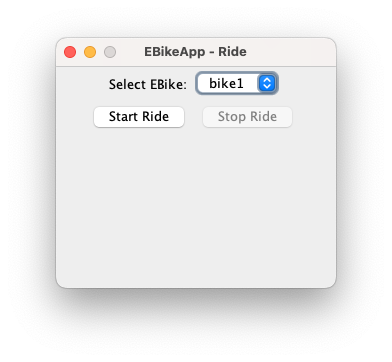
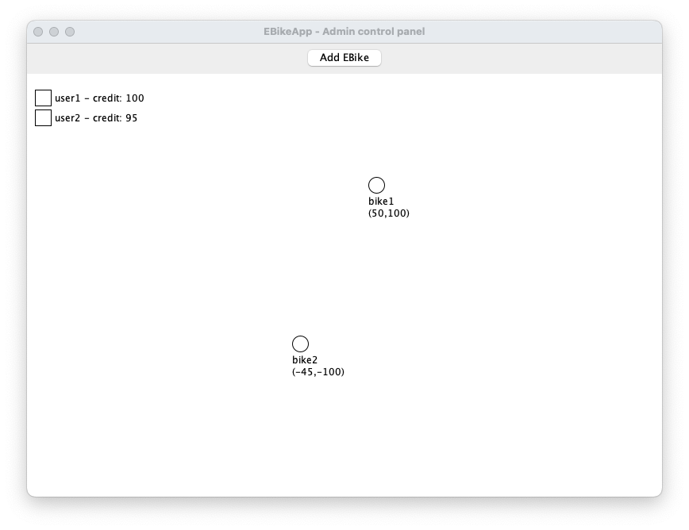
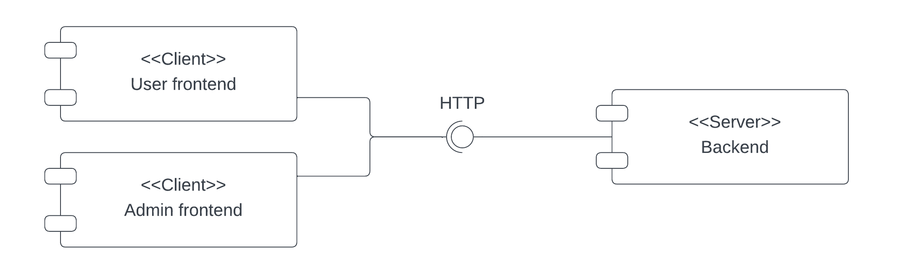
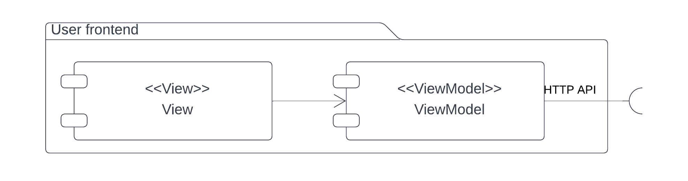
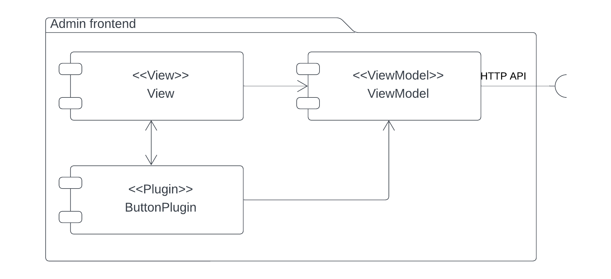
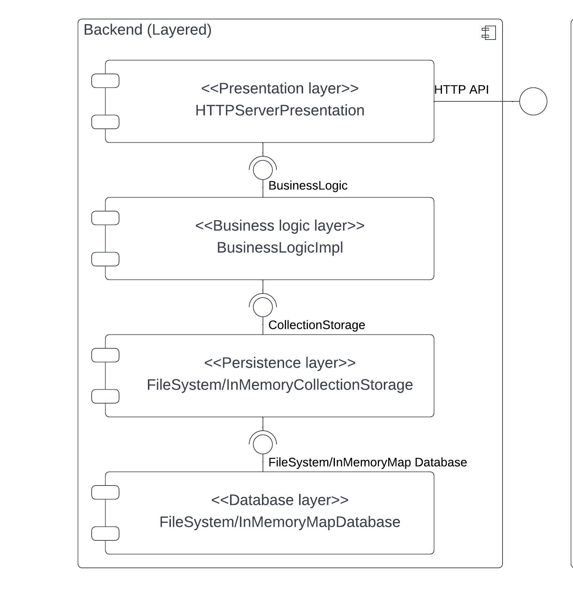
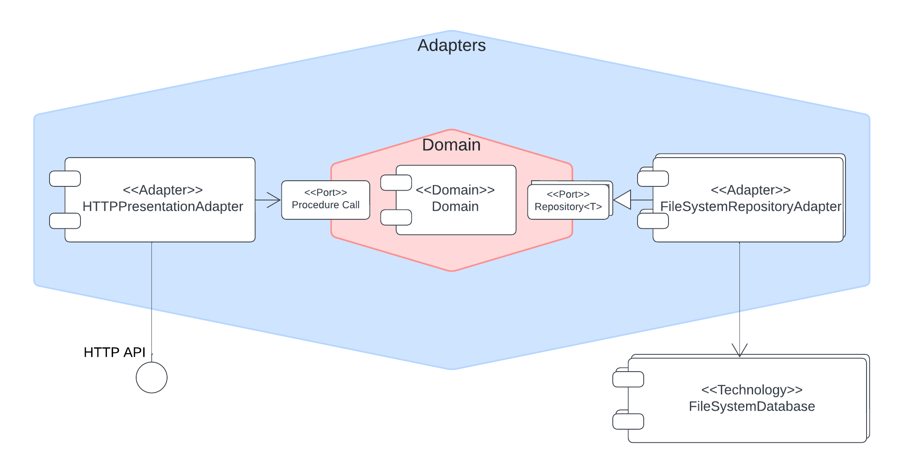

# Report

## Requisiti

L'utente:
- deve potersi registrare
- deve poter fare login
- deve poter selezionare una bici e iniziare / terminare una corsa.

L'amministratore:
- deve poter vedere la posizione di tutte le bici
- deve poter aggiungere nuove bici al sistema

## Quality Attributes Scenarios (QAS)
|Quality attribute|Source|Stimulus|Artifact|Environment|Response|Response measure|
|------------|------------|------------|------------|------------|------------|------------|
|Modificabilità|Provider DB|Modifica la licenza|Base di codice|Situazione normale|Sviluppatori sostituiscono il DB con un altro|Codice non riguardante la persistenza non deve essere modificato|
|Estendibilità|Stakeholder|Richiede un client mobile|Base di codice|Situazione normale|Sviluppatori realizzano un nuovo client mobile che usi le API web già esistenti|Codice preesistente non modificato|
|Testabilità|Sviluppatori|Devono testare un componente del sistema inpendentemente dagli altri|Base di codice|Fase di sviluppo|Sviluppatori realizzano dei componenti mock che implementino le interfacce richieste dal componente sotto test|Il componente può essere testato in maniera inipendente senza dover modificare codice di produzione|
|Estendibilità|Amministratore|Vuole aggiungere funzionalità alla console senza riavviarla|Client *admin*|Situazione normale|Gli sviluppatori forniscono un plugin con la nuova funzionalità implementata|Il client ottiene la nuova funzionalità senza mai essere riavviato|

## Utilizzo
Per lanciare il sistema avviare solo uno tra i due backend:
- [HexagonalBackendApp.java](../src/main/java/sap/ass01/solution/backend/hexagonal/HexagonalBackendApp.java)
- [LayeredBackendApp.java](../src/main/java/sap/ass01/solution/backend/layered/LayeredBackendApp.java)

E poi avviare un numero di istanze a piacere dei client:
- [EBikeAdminApp.java](../src/main/java/sap/ass01/solution/frontend/admin/EBikeAdminApp.java)
- [EBikeUserApp.java](../src/main/java/sap/ass01/solution/frontend/user/EBikeUserApp.java)

## Architettura del sistema completo

Il sistema sarà composto da un server e due client:
- admin: pannello di controllo dell'amministratore
- user: applicazione dell'utente

Si è scelto di utilizzare una API REST HTTP per implementare la comunicazione tra client e server. Non ci saranno quindi dipendenze nel codice in nessuna direzione tra client e server, questo viene [testato](../src/test/java/sap/ass01/solution/ClientServerArchTests.java) con ArchUnit.

L'utilizzo di una API REST HTTP permette di passare il QAS riguardo all'estendibilità (possibile aggiunta di client mobile).

## Architettura dei client

Entrambi i client sono molto semplici e implementano un'architettura del tipo MVVM (dove il ruolo di Model viene giocato dal server.)

### Client user

### Client admin

#### Architettura a micro-kernel

Si è implementata una versione estremamente semplificata di questa architettura nel client admin.

E' infatti possibile aggiungere dinamicamente a runtime dei bottoni che aggiungono funzionalità al client. Questi devono implementare l'interfaccia [ButtonPlugin.java](../src/main/java/sap/ass01/solution/frontend/admin/ButtonPlugin.java) e hanno accesso al View Model e alla View.

Questo permette di passare il QAS riguardo all'estendibilità (estensione delle funzionalità dell'admin).

> **Nota:**
>
> Questa implementazione è davvero semplice in quanto in realtà queste funzionalità sono già implementate e disponibili nel server.
> Un'approccio interessante sarebbe stato quello di implementare ogni funzionalità sul server come un plugin, si è scelto però di non farlo per non rendere la realizzazione di questo assignment troppo lunga.

### Plugin realizzati
Si sono realizzati due plugin:
- [CreateEBikePlugin.java](../src/main/java/sap/ass01/solution/frontend/admin/plugins/CreateEBikePlugin.java) è il plugin che permette all'amministratore di aggiungere bici al sistema. Questo viene aggiunto a compile time in quanto è una funzionalità essenziale che era presente nei requisiti.

- [DeleteEBikePlugin.jar](../compiled-plugins/DeleteEBikePlugin.jar) è il plugin che permette all'amministratore di eliminare una bici dal sistema.

  (Si noti che i [sorgenti](../src/main/java/sap/ass01/solution/pluginsdevelopment/), una volta compilati nel JAR,  sono stati commentati in modo da non farli compilare dall'IDE all'avvio dell'applicazionie.)

## Architettura del server

Entrambe le architetture scelte permettono, grazie all'uso intensivo di interfacce, di passare i QAS riguardanti la testabilità e la modificabilità.

### Layered

Si è scelto di impostare l'architettura su 4 layer.

Ogni layer può interagire solo con il layer sottostante e non può saltare layer. Inoltre ogni layer ha le proprie strutture dati che vengono convertite tra di loro durante le interazioni.

Tutte queste caratteristiche vengono [testate](../src/test/java/sap/ass01/solution/backend/layered/LayeredArchTests.java) con ArchUnit.

|Layer|Descrizione|
|-----|-----------|
|Presentation| Il layer di presentation è implementato attraverso un server http (Vertx) che espone un'API REST e non fa altro che girare le richieste alla buisness logic effettuando marshaling e unmarshaling dei messaggi.|
|BusinessLogic| Il layer di business logic espone tutte le operazioni che possono essere eseguite sul dominio, e sfrutta il livello inferiore per effettuare la persistenza dei dati.
|Persistence| Questo layer espone un'interfaccia semplice ovvero quella di persistenza di collezioni di elementi (CollectionStorage).   Sono fornite due implementazioni di questo layer, una che si basa su un layer database che sfrutta il file system ([FileSystemDatabase.java](../src/main/java/sap/ass01/solution/backend/layered/database/FileSystemDatabase.java)) e una che si basa su un layer database che sfrutta un dizionario in memoria ([InMemoryMapDatabase.java](../src/main/java/sap/ass01/solution/backend/layered/database/InMemoryMapDatabase.java)).
|Database| Questo layer espone due interfacce ed implementazioni differenti, una che sul file system ([FileSystemDatabase.java](../src/main/java/sap/ass01/solution/backend/layered/database/FileSystemDatabase.java)) e che quindi realizza persistenza anche oltre la chiusura del programma.    E una che si basa su un dizionario in memoria ([InMemoryMapDatabase.java](../src/main/java/sap/ass01/solution/backend/layered/database/InMemoryMapDatabase.java)) e che quindi perde i dati una volta riavviato il programma.

Il motivo per cui si sono scritte due implementazioni dei layer Database e Persistence è proprio per dimostrare che è possibile scambiare queste senza intaccare minimamente i livelli superiori (Business Logic e Presentation).
In questo caso quindi il layer Persistence gioca il ruolo di un'interfaccia / adattatore per il layer Database.

### Hexagonal

L'architettura esagonale presenta anch'essa dei layer:

|Layer|Descrizione|
|-----|-----------|
|Domain| In questo layer sono situate la logica e le entità del dominio|
|Ports| Questo non è un vero e proprio layer, ma le *ports* sono interfacce o protocolli che fungono da ponte tra il layer di Domain e quello degli Adapters|
|Adapters| In questo layer sono situati gli *adapters* ovvero componenti che adattano il comportamento delle tecnologie al protocollo/interfaccia presentato dalle *ports*|
|Technologies| Contiene tutte le tecnologie come ad esempio il client oppure i database|

> **Nota:**
>
> Per enfatizzare l'estensibilità e il disaccoppiamento fornito da questa architettura si è scelto che il dominio utilizzi una repository per ogni entità che deve persistere (User, EBike e Ride).
>
> Questo significa che in, maniera trasparente al Dominio, il sistema potrebbe anche utilizzare contemporaneamente database diversi per le diverse entità.
> (Nel diagramma questo è mostrato dai componenti sulla destra che hanno un aspetto diverso)

L'architettura è rafforzata attraverso dei [test](../src/test/java/sap/ass01/solution/backend/hexagonal/HexagonalArchTests.java) con Archunit
